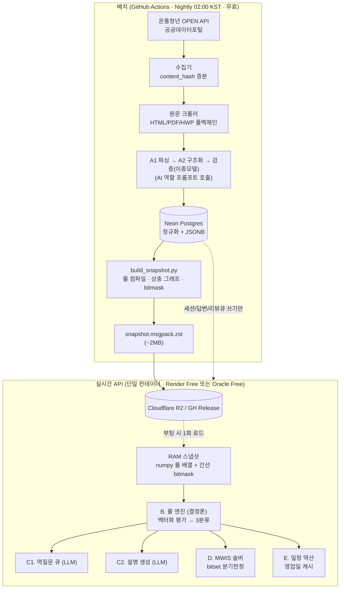

# YPC Backend — 아키텍처 설계서 v1.0

> 대상: BE 역할 (PRD v1.0 §5 / 역할별 마일스톤 v2.0 B·D·E 레이어 + 인프라)
> 작성일: 2026-09-13 (M0 착수 전일)
> 제약: **무료 인프라만 사용**, p95 ≤ 5초, 사용자당 LLM 비용 ≤ 300원

---

## 0. 설계 결론 3줄

1. **스냅샷 인메모리 아키텍처** — 배치가 만든 "컴파일된 정책 스냅샷"을 API 프로세스가 RAM에 통째로 올린다. 판정 요청은 **DB를 단 한 번도 건드리지 않는다.**
2. **무료 티어의 최대 약점(Cold start · Scale-to-zero)을 아키텍처로 무력화한다.** DB가 잠들어 있어도 판정은 정상 동작한다.
3. **런타임 의존성을 최소화한다.** MVP에서 Redis · Celery · PuLP/CBC 제거. 단일 컨테이너 = 어디로든 30분 안에 이사 가능.

---

## 1. 무료 티어 실사 결과 (2026-09 기준)

| 후보 | 현황 | 판정 |
| --- | --- | --- |
| **Neon Postgres** | Free: 0.5GB 스토리지, 100 CU-h/월, **5분 유휴 시 scale-to-zero**, pgvector 지원 | ✅ **채택** (DB) |
| Supabase | Free: 500MB DB, pgvector 포함, **7일 무요청 시 프로젝트 일시정지** | 🔄 백업 |
| **Render** | Free 웹서비스: 512MB/0.1CPU, **15분 유휴 시 spin-down → 콜드스타트 30~60초**, 750 인스턴스-h/월 | ✅ **채택** (API, 1차) |
| **Oracle Cloud Always Free** | ARM Ampere A1 **2 OCPU / 12GB** (2026-06-15부로 4/24 → 2/12 축소), 상시 가동, 카드 등록 필요 | ✅ **채택** (API, 부하 시 이전 대상) |
| Fly.io | **2024년 무료 티어 폐지.** 현재 2 VM-시간 / 7일 트라이얼만 | ❌ 제외 |
| Koyeb | Free: 512MB/0.1vCPU + Postgres 1GB | 🔄 백업 |
| Cloudflare Workers | 100K req/일, 무료, 콜드스타트 없음. **단 Python 미지원(JS/WASM)** | ❌ 본 API 부적합 |
| **GitHub Actions** | public repo 무제한 / private 2,000분·월 | ✅ **채택** (배치 러너) |
| **Cloudflare R2** | 10GB 무료, 이그레스 무료 | ✅ **채택** (스냅샷·원문 아카이브) |

> 🔴 **핵심 시사점**: 무료 티어에 "항상 깨어 있고 빠른 DB"는 존재하지 않는다. 그러므로 **판정 경로에서 DB를 제거하는 것**이 무료화와 고성능을 동시에 얻는 유일한 길이다.

---

## 2. 전체 구성도



**읽기 경로(판정)와 쓰기 경로(세션 저장)를 물리적으로 분리한다.** 판정은 RAM, 저장은 Postgres. Neon이 scale-to-zero로 잠들어 있어도 판정 API는 즉시 응답하고, 세션 저장은 비동기 백그라운드로 미룬다.

---

## 3. 핵심 설계 결정 (ADR 요약)

### ADR-001. 스냅샷 인메모리 룰 엔진 — 채택

**문제**: PRD는 후보 축소를 "DB 인덱스로 처리"하도록 명시(§7.2). 그러나 무료 Postgres는 5분 유휴 후 첫 쿼리에 수백 ms의 웜업이 붙고, 커넥션 수도 제약된다.

**결정**: 정책 데이터는 **1차 범위 150~600건(G0 기준), 최대 3,000건**으로 유계이고, **하루 1회만 변한다.** 따라서 배치가 전부 컴파일해 단일 아티팩트로 굽고, API는 부팅 시 RAM에 올린다.

**효과**
- 판정 1회 = DB 왕복 0회. 목표 p95 5초 → **실측 목표 150ms**
- Neon 100 CU-h/월을 배치와 세션 쓰기에만 사용 → 무료 한도 내 안착
- API 인스턴스를 늘려도 DB 부하가 0 (수평 확장 무료)

**비용**: 정책 갱신 반영이 최대 24시간 지연. → 공고는 일 단위로 바뀌므로 수용. 긴급 시 `POST /v1/admin/reload` 로 즉시 재로딩.

**메모리 추정**: 3,000정책 × (룰 20개 + 스키마 JSON 8KB) ≈ **RAM 60~90MB**. Render Free 512MB 안에 여유 있게 들어간다.

---

### ADR-002. 룰 평가를 numpy 벡터화 — 채택

3,000개 정책 × 20개 룰을 파이썬 루프로 돌면 6만 회 인터프리터 호출이다. 대신 **필드별 열(column) 배열**로 뒤집는다.

```
컴파일 시:            런타임(사용자 1명):
age_min:  int16[3000]   ok  = (age_min <= u.age) & (u.age <= age_max)
age_max:  int16[3000]   ok &= (res_min_months <= u.res_months)
res_min:  int16[3000]   ok &= (income_max >= u.income_ratio)
income_max: int16[3000] ...
```

- 20개 필드 × 3,000 = **numpy 연산 20회, 총 < 1ms**
- 미확인 필드는 별도 `unknown_mask` 비트배열로 동시 추적 → `NEEDS_INFO` 분류가 공짜
- 지역·범주 같은 집합형 조건은 `region_codes && ARRAY['00','41','41465']` 형태의 **접두 체인 확장** 후 bitset 교집합

> 사용자 지역코드 `41465`는 컴파일 단계에서 `['00'(전국), '41'(경기), '41465'(용인 수지)]` 로 확장한다. 접두 매칭을 집합 교집합으로 바꿔 인덱스/비트연산으로 처리하기 위함이다.

---

### ADR-003. MWIS 솔버에서 PuLP/CBC 제거 — 채택

PRD §7.4는 정점 40 초과 시 ILP(PuLP+CBC)를 제안한다. 그러나:
- `ELIGIBLE` 정책은 실사용상 **10~30개** 수준 (전체의 5~10%)
- CBC는 바이너리 설치가 무겁고 ARM/슬림 이미지에서 자주 깨진다 (무료 티어 리스크)

**결정**: 정점 ≤ 64인 경우 **인접관계를 파이썬 정수 bitmask**로 표현하고 **분기한정(Branch & Bound) 정확해**를 쓴다.

```python
# adj[i] : i와 상충하는 정점들의 비트마스크
# 남은 후보를 하나의 int로 들고 다니며 재귀 → 정확해, 의존성 0
```
- 정점 64 이하에서 밀리초 단위, **정확해 100% 보장** (G4 게이트 기준: 완전탐색과 100% 일치)
- 64 초과는 실질적으로 발생하지 않으나, 발생 시 탐욕+지역탐색 근사로 폴백하고 결과에 `approx=true` 표기
- PuLP/CBC는 `requirements-optional.txt`로 분리 보관

---

### ADR-004. Redis 제거 — 채택

PRD §8.1은 Redis(캐시/큐)를 명시한다. 하지만 스냅샷 아키텍처에서는:
- **캐시 대상이 사라진다** (판정 자체가 1ms)
- **큐가 필요 없다** (배치는 GitHub Actions cron, 실시간 비동기는 FastAPI BackgroundTasks)

무료 Redis(Render 25MB / Upstash 10K cmd·일)는 한도가 빠듯하고 장애점만 늘린다. → **MVP 제외.** 필요해지면 `app/core/cache.py` 인터페이스 뒤에서 교체한다(현 구현: 인프로세스 LRU).

---

### ADR-005. 회원가입 없는 익명 세션 (Q4 잠정 결정)

**가정**: MVP는 **로그인 없이 세션 쿠키(UUID) 기반**으로 간다. 근거 — 판정 1회에 회원가입 벽을 세우면 이탈률이 치명적이고, PRD §8.3의 "수집 최소화" 원칙과도 일치한다. Q4 최종 결정(11/18) 시 이메일 로그인만 얹으면 되도록 `user_session` 테이블을 선분리해 둔다.

개인정보 처리:
- 프로필 값은 **AES-256-GCM으로 암호화해 BYTEA 저장** (DB 유출 시에도 평문 없음)
- 통계 컬럼은 식별 불가 수준(`birth_year`, 시도 2자리)만 별도 보관
- `expires_at` 기본 90일 + Nightly 하드 삭제 잡

---

### ADR-006. 배치 러너 = GitHub Actions

APScheduler를 API 프로세스 안에 두면(PRD §8.1) 무료 티어에서 두 가지가 깨진다: ① Render Free는 유휴 시 spin-down되어 02:00에 깨어 있지 않다 ② 크롤링+LLM이 API 메모리를 잡아먹는다.

**결정**: 배치는 **GitHub Actions cron**(`0 17 * * *` UTC = 02:00 KST)으로 완전 분리. 실행 결과는 Postgres + R2 스냅샷. API는 배치의 존재를 모른다.
- 부수 효과: 배치 로그·재실행·시크릿 관리를 GitHub이 무료로 대신 해준다
- public repo면 Actions 분 무제한

---

## 4. 레이어 · 모듈 구조

```
BE/
├─ app/                        # 실시간 (온라인)
│  ├─ main.py                  # FastAPI 앱, lifespan에서 스냅샷 로드
│  ├─ api/v1/
│  │   ├─ sessions.py          # 세션 생성/동의
│  │   ├─ judge.py             # POST /v1/judge      ← B
│  │   ├─ questions.py         # 역질문 큐 / 답변     ← C1
│  │   ├─ combinations.py      # 조합 추천            ← D
│  │   ├─ plan.py              # 신청 계획 / .ics     ← E
│  │   ├─ policies.py          # 정책 상세
│  │   └─ admin.py             # 검증 큐, 스냅샷 리로드
│  ├─ engine/                  # 🔵 B 레이어 — 결정론
│  │   ├─ snapshot.py          # 스냅샷 로더 / 핫스왑
│  │   ├─ compile.py           # DB → numpy 열 배열 + bitset
│  │   ├─ evaluate.py          # 벡터화 판정 → ELIGIBLE/INELIGIBLE/NEEDS_INFO
│  │   ├─ timeline.py          # 충족 예상일 계산
│  │   └─ explain.py           # 근거 조립 (source_quote 부착)
│  ├─ solver/mwis.py           # 🔵 D 레이어 — bitset 분기한정
│  ├─ planner/                 # 🔵 E 레이어
│  │   ├─ businessday.py       # 영업일 계산 (holiday 캐시)
│  │   ├─ backplan.py          # 권장 착수일 역산
│  │   └─ ics.py
│  ├─ llm/                     # 🟡 C 레이어 — AI 역할과의 경계면
│  │   ├─ client.py            # 재시도/타임아웃/토큰 회계
│  │   ├─ prompts/             # ← AI 역할이 소유. BE는 호출만
│  │   └─ budget.py            # 사용자당 300원 상한 가드
│  ├─ schemas/                 # PolicySchema / UserProfile / JudgementResult
│  ├─ db/                      # asyncpg 풀, 리포지토리
│  └─ core/                    # config, crypto, logging, errors
├─ batch/                      # 배치 (오프라인)
│  ├─ collect/                 # 온통청년·공공데이터포털 수집
│  ├─ crawl/                   # 원문 크롤러 + 포맷 폴백체인
│  ├─ parse/                   # HTML/PDF/HWP 추출기
│  ├─ agents/                  # A1→A2→검증 오케스트레이션
│  ├─ build_snapshot.py        # 🔴 스냅샷 빌더 (아키텍처의 심장)
│  └─ holidays.py              # 한국천문연구원 특일 API 동기화
├─ db/migrations/              # 순번 SQL
├─ tests/
│  ├─ unit/                    # 룰 엔진·솔버·영업일
│  ├─ golden/                  # 골든셋 200건 정확도 하네스
│  └─ e2e/
├─ Dockerfile                  # 단일 이미지 = 호스팅 락인 없음
└─ .github/workflows/{ci,nightly}.yml
```

**역할 경계 고정** (마일스톤 §0)
- `app/llm/prompts/` 는 **AI 역할 소유**. BE는 스키마 검증과 호출만 한다.
- `app/engine/`, `app/solver/`, `app/planner/` 는 **LLM을 import 하지 않는다.** (린트 규칙으로 강제)

---

## 5. API 계약 (C2: BE ↔ FE, 확정 목표 10/07)

| Method | Path | 설명 | 목표 p95 |
| --- | --- | --- | --- |
| POST | `/v1/sessions` | 익명 세션 발급 + 약관 동의 | 50ms |
| POST | `/v1/judge` | 프로필 → 전 정책 일괄 판정 | **150ms** |
| GET | `/v1/judge/{session_id}` | 판정 결과 재조회 (ETag) | 30ms |
| GET | `/v1/questions/{session_id}` | 역질문 큐 (병합·정렬·상한 10) | 800ms* |
| POST | `/v1/answers/{session_id}` | 답변 저장 → **증분 재판정** | 100ms |
| GET | `/v1/policies/{policy_id}` | 정책 상세 + 원문 인용 | 30ms |
| POST | `/v1/combinations/{session_id}` | 보수/최대 2안 × 상위 3조합 | **50ms** |
| GET | `/v1/plan/{session_id}` | 서류·권장 착수일 | 50ms |
| GET | `/v1/plan/{session_id}.ics` | 캘린더 내보내기 | 50ms |
| GET | `/v1/meta/snapshot` | 스냅샷 버전·정책 건수 | 5ms |
| GET | `/healthz` `/readyz` | 헬스체크 (keep-alive 핑 대상) | 1ms |
| GET/PATCH | `/v1/admin/review-queue` | needs_review 큐 | — |

\* 역질문만 LLM 호출을 포함한다. 질문 템플릿이 이미 `policy_rule.question_template`에 있으면 LLM을 건너뛰고 **0ms 경로**로 간다. → LLM 호출은 신규 필드가 나타났을 때만.

**공통 규약**
- 모든 응답에 `snapshot_version` 포함 → FE가 캐시 무효화 시점을 스스로 판단
- 판정 응답에 `ETag: W/"{snapshot_version}:{profile_hash}"` → 재조회 시 304
- `NEEDS_INFO`/`ESTIMATED`/`NEEDS_REVIEW` 항목은 **반드시** `source_quote` + `source_url` + `dept_tel` 동반 (스키마 레벨 필수 필드)
- 에러는 RFC 9457 `application/problem+json`. **FE 는 상태 코드가 아니라 `type` 으로 분기한다** —
  같은 503 이 "스냅샷 미적재(아무것도 안 된다)"와 "세션 저장소 불가(판정은 된다)" 두 뜻으로 쓰인다.
  유형 표는 `docs/contracts/problems.json` (코드가 원본: `app/core/problem.py`)

---

## 6. 성능 예산 — 실측 검증 완료

> 아래는 추정이 아니라 **본 레포에서 실제로 돌려 측정한 값**이다.
> 검증 환경: PostgreSQL 16.13 로컬 인스턴스 + Python 3.11 / numpy 2.4 (2026-09-13)

### 6.1 측정 결과

> `bench/engine_bench.py` 는 **프로토타입이 아니라 실제 룰 엔진**(`app/engine/`)을 잰다.
> 숫자가 무너지면 CI 가 실패한다 — 인메모리 설계의 전제가 깨졌다는 뜻이기 때문이다.

| 항목 | 1차 범위 (600 정책 / 2,442 룰) | 전국 확장 (3,000 정책 / 12,208 룰) | 목표 |
| --- | --- | --- | --- |
| **판정 1회** (전 정책 3분류) | **0.14 ms** | **0.51 ms** | < 50ms |
| **전 정책 근거 조립** (최악 가정) | 7.9 ms | 35.8 ms | — |
| 스냅샷 컴파일 (부팅 시 1회) | 3.0 ms | 17.6 ms | — |
| 룰 그룹 수 | 6 | 6 | — |

| 솔버 (ADR-003) | 측정값 | 목표 |
| --- | --- | --- |
| MWIS 정확성 (정점 ≤12, 20건) | **20/20 완전탐색 일치** | G4: 100% |
| MWIS 정점 30개 (실사용 규모) | 1.7 ms | p95 ≤ 2,000ms |
| MWIS 정점 64개 (최악) | 56 ms | p95 ≤ 2,000ms |

| DB (배치 경로) | 측정값 |
| --- | --- |
| 전량 스캔 (3,000 정책) | 0.53 ms |
| 물리 크기 (스키마JSON 제외) | 1.5 MB / 72 페이지 |

> **룰 그룹이 6개뿐인 이유**: 룰을 '정책별'이 아니라 '(필드, 연산자)별'로 모으기
> 때문이다. 12,208개 룰이 6번의 numpy 연산으로 처리된다. 정책이 5배로 늘어도
> 그룹 수는 그대로이고 배열 길이만 길어진다 — 그래서 0.14ms → 0.51ms 로
> 선형보다 완만하게 증가한다.

### 6.2 측정에서 나온 아키텍처적 발견

🔎 **3,000건 전체가 72 페이지(1.5MB)라, 플래너가 GIN 인덱스를 무시하고 Seq Scan(0.67ms)을 선택했다.**

이것은 인덱스 설계 실패가 아니라 **ADR-001을 뒷받침하는 증거**다. 데이터셋 전체가 Postgres 버퍼 한 줌에 들어간다면, 그것을 애플리케이션 RAM에 통째로 올리는 것은 트릭이 아니라 **자연스러운 형상**이다. PRD §7.2가 요구한 "DB 인덱스 기반 후보 축소"는 이 규모에서 오버엔지니어링이며, 인메모리 벡터 연산이 같은 일을 **1,000배 빠르고 DB 부하 0**으로 해낸다.

> `policy_region_gin` 인덱스는 유지한다. 실시간 경로에서는 안 쓰이지만 관리자 조회·애드혹 쿼리·향후 확장에 필요하고, 야간 배치 3,000행 쓰기 비용은 무시 가능하다.

### 6.3 요청 1건 예산 (판정 API)

| 구간 | 예산 | 근거 |
| --- | --- | --- |
| 요청 파싱·검증 | 5ms | msgspec 디코딩 |
| **룰 평가 (전 정책)** | **0.5ms** | 실측 (3,000 정책) |
| 근거 조립 + 충족 예상일 | 36ms | 실측, 전 정책 최악 가정 |
| 직렬화 (orjson + gzip) | 15ms | ~300KB → 40KB |
| **합계** | **~57ms** | 네트워크 제외 |
| 세션 저장 (비동기) | 0ms | BackgroundTask, 응답 블로킹 없음 |

> PRD 요구 p95 5초 대비 **여유 87배**. 1차 범위(600 정책)에서는 ~28ms다.
> 0.1 CPU 무료 인스턴스에서 10배 느려져도 목표를 지킨다.
>
> 근거 조립이 판정보다 70배 비싸다. 실제로는 사용자가 펼친 정책만 조립하면
> 되므로 더 줄어들지만, **전 정책을 조립해도 예산 안에 들어오는 것**을 확인해
> 두었다 — 최적화가 필요해지기 전까지는 단순한 쪽을 유지한다.

### 6.4 성능 규칙 (코드 레벨 — 린트로 강제)

1. **핫 경로에 `await db.*` 금지** — `app/engine`, `app/solver`, `app/planner` 는 DB 모듈을 import 하지 않는다
2. **`app/engine`·`app/solver`·`app/planner` 는 `app/llm` 을 import 하지 않는다** (역할 경계: 결정론 레이어)
3. 직렬화는 `orjson`, 내부 모델은 `msgspec.Struct` (Pydantic은 API 경계에만)
4. `asyncpg` + `uvloop` (psycopg2 등 동기 드라이버 금지)
5. 워커 1개 + 스냅샷 공유. 다중 워커는 RAM이 배로 드니 무료 티어에선 금지
6. 응답 gzip + ETag(`snapshot_version:profile_hash`) + `Cache-Control: private, must-revalidate`

### 6.5 재현 방법

```bash
# DB 스키마 검증 (제약조건 16종 동작 확인)
psql "$DATABASE_URL" -v ON_ERROR_STOP=1 -f db/migrations/0001_init.sql

# 엔진 성능 벤치마크
python bench/engine_bench.py
```

---

## 7. 배포 형상

```
GitHub push ──> Actions CI (lint·type·test·golden) ──> Docker build
                                                          │
                          ┌───────────────────────────────┴──────────────┐
                          ▼                                              ▼
                 Render Free (1차, 카드 불필요)              Oracle Always Free (2차, 상시가동)
                 512MB / 0.1CPU / 750h·월                    ARM 2 OCPU / 12GB
                 + Actions cron keep-alive (10분)            + Caddy 자동 TLS
```

**콜드스타트 대응**: Render Free는 15분 유휴 시 내려간다. 월 744시간 < 무료 750 인스턴스-시간이므로, **GitHub Actions cron이 10분마다 `/healthz`를 치면 한도 안에서 상시 가동 상태**가 된다. UT(n=20) 기간에 이것만으로 콜드스타트 0을 만든다.
그래도 0.1 CPU가 부족하면 **동일 Docker 이미지를 Oracle Always Free로 이전**한다 (환경변수 교체뿐, 예상 30분).

**환경 변수** (전부 Actions Secrets / 호스팅 Secret에 보관, 레포에 평문 금지)
```
DATABASE_URL, PROFILE_ENC_KEY(32B base64), ONTONG_API_KEY,
DATA_GO_KR_KEY, KASI_API_KEY, LLM_API_KEY, SNAPSHOT_URL, ADMIN_TOKEN
```

---

## 8. 관측 · 품질 게이트 자동화

| 항목 | 수단 | 게이트 |
| --- | --- | --- |
| 판정 정확도 / FN률 | `tests/golden/` 하네스가 CI에서 매 PR 실행 | G2: ≥92% / ≤5% — **미달 시 CI 실패** |
| `source_quote` 보유율 | DB `NOT NULL` + `CHECK(length(trim())>0)` | G1: 100% — **DB가 구조적으로 강제** |
| 솔버 정확성 | 정점 ≤12 케이스 20건 완전탐색 대조 | G4: 100% 일치 — CI |
| p95 응답시간 | `X-Process-Time` 헤더 + Actions 부하 스모크 | G2: ≤5초 |
| LLM 비용 | `llm_usage` 테이블 집계 | ≤300원/user — 초과 시 배치 중단 |
| 영업일 계산 | 2026 공휴일 전수 테스트 | G5: 100% |

> 🔴 `source_quote` 100%는 문서상 약속이 아니라 **DB 제약조건**이다. 근거 없는 룰은 INSERT 자체가 실패한다.

---

## 9. 리스크 · 대응 (BE 관점)

| # | 리스크 | 대응 |
| --- | --- | --- |
| BE-R1 | Neon 0.5GB 초과 (원문 텍스트 누적) | 원문은 **gzip BYTEA + 최신본만** DB, 이력은 R2. 600건 × 50KB ≈ 30MB로 여유 |
| BE-R2 | Neon 100 CU-h/월 초과 | 판정이 DB를 안 쓰므로 소비처는 배치(야간 1h)와 세션 쓰기뿐. 여유 |
| BE-R3 | Render 콜드스타트가 UT를 망침 | keep-alive 핑 + Oracle 이전 경로 사전 준비 (Docker 단일 이미지) |
| BE-R4 | 스냅샷 손상으로 전체 장애 | 빌드 시 checksum + 스키마 검증, **로드 실패 시 직전 스냅샷 유지**(핫스왑 롤백) |
| BE-R5 | G2 정확도 92% 미달 | 마일스톤 원칙대로 M4 축소하고 M2에 +1주. 골든셋 하네스가 CI에 있어 조기 감지 |
| BE-R6 | 무료 티어 정책 변경 | 호스팅 락인 0 (Docker + 표준 Postgres). 이전 비용이 항상 30분 이내 |

---

## 10. 착수 순서 (DB부터)

```
Step 1  db/migrations/0001_init.sql  ← 본 커밋에 포함
Step 2  app/schemas/ (PolicySchema/UserProfile/JudgementResult) + 밸리데이터   [BE-M1-1]
Step 3  app/db/ (asyncpg 풀) + 시드 데이터 + 마이그레이션 러너
Step 4  batch/collect/ (온통청년 API 조사)                                     [BE-M0-1~5]
Step 5  app/engine/compile.py + evaluate.py (룰 엔진 코어)                     [BE-M2-3]
Step 6  build_snapshot.py → 스냅샷 로더 → /v1/judge                            [BE-M2-7]
Step 7  solver/ → planner/                                                     [BE-M4/M5]
```

DB가 먼저인 이유: `PolicySchema`는 AI↔BE 계약면(C1, 10/02 Freeze)이고, 스키마가 흔들리면 배치·룰엔진·스냅샷이 전부 재작업된다. **테이블 제약조건으로 계약을 못 박은 뒤 위를 쌓는다.**
