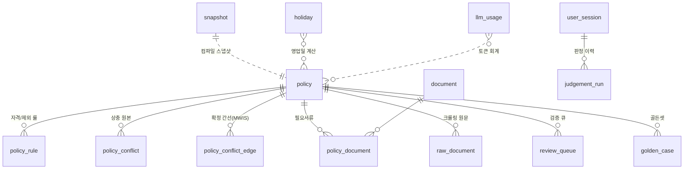

# YPC Backend — DB 설계서 v1.0

> 대상 DBMS: PostgreSQL 15+ (배포: Neon Free 0.5GB)
> 마이그레이션: `db/migrations/0001_init.sql`  |  검증: `db/verify_schema.sql`
> 검증 상태: **PostgreSQL 16.13에서 적용 성공, 제약조건 16종 동작 확인 완료 (2026-09-13)**

---

## 1. 설계 원칙 4가지

| # | 원칙 | 구현 |
| --- | --- | --- |
| 1 | **판정에 쓰는 값만 컬럼으로 승격** | 지역·연령·마감일·수혜액만 컬럼. 나머지 PolicySchema 전문은 `schema_json JSONB` 1개 |
| 2 | **계약을 DB가 강제한다** | `source_quote NOT NULL + 공백금지` → 근거 없는 룰은 INSERT 자체가 실패 |
| 3 | **개인정보 평문 컬럼 없음** | 프로필·답변·판정결과를 앱에서 AES-256-GCM 암호화 후 `BYTEA` 저장 |
| 4 | **무료 0.5GB 대비 압축 저장** | 크롤링 원문은 `gzip BYTEA` + 최신본만. 이력은 오브젝트 스토리지 |

### 왜 "하이브리드(컬럼 + JSONB)"인가

- **순수 JSONB**: 스키마 변경은 자유롭지만 제약조건을 걸 수 없다 → `source_quote` 100%를 강제할 방법이 사라진다 (G1 게이트 붕괴)
- **완전 정규화**: `eligibility` 룰의 `value`가 숫자·배열·불리언을 오가므로 컬럼 타입이 정해지지 않는다
- **하이브리드(채택)**: 룰은 `policy_rule` 행으로 평탄화해 **제약조건을 걸고**, 원본 전문은 `schema_json`으로 **손실 없이 보관**한다

---

## 2. 테이블 맵 (14종)



| # | 테이블 | 역할 | 담당 레이어 | 예상 행 수 (1차 범위) |
| --- | --- | --- | --- | --- |
| 1 | `policy` | 정책 마스터 | 배치 write / 스냅샷 read | 150~600 |
| 2 | `policy_rule` | 자격·제외 룰 평탄화 | 룰 엔진 컴파일 입력 | ~5,000 |
| 3 | `policy_conflict` | 상충 관계 원본(공고문 추출 그대로) | 배치 | ~500 |
| 4 | `policy_conflict_edge` | **확정 무향 간선** (솔버가 읽는 유일한 표) | D 솔버 | ~800 |
| 5 | `document` | 서류 마스터 (수작업 30~50종) | E 역산 | 30~50 |
| 6 | `policy_document` | 정책↔서류 | E 역산 | ~2,000 |
| 7 | `holiday` | 공휴일 캐시 (한국천문연구원) | E 역산 | ~20/년 |
| 8 | `user_session` | 익명 세션 (암호화) | API | 사용자 수 |
| 9 | `judgement_run` | 판정 실행 기록 / 증분 재판정 | API | 세션 × 재판정 |
| 10 | `review_queue` | `needs_review` 관리자 큐 (S8) | 관리자 | 가변 |
| 11 | `raw_document` | 크롤링 원문 (gzip) | 배치 | 150~600 |
| 12 | `llm_usage` | 토큰·비용 회계 (KPI ≤300원/user) | 전 레이어 | 가변 |
| 13 | `snapshot` | 컴파일 스냅샷 메타 (활성본 1개) | 배치/API | ~90 (보관) |
| 14 | `golden_case` | 골든셋 200건 (G2 정확도 하네스) | CI | 200 |

---

## 3. 핵심 설계 포인트 5가지

### 3.1 🔴 `source_quote` 를 DB가 강제한다

```sql
source_quote TEXT NOT NULL,
CONSTRAINT policy_rule_quote_not_blank CHECK (length(btrim(source_quote)) > 0)
```

마일스톤 문서의 **"`source_quote` 100%는 타협 대상이 아니다"** 를 문서상의 약속이 아니라 **물리적 불가능**으로 바꾼다. AI 에이전트가 근거 없는 룰을 뱉으면 배치가 INSERT에서 실패하고, 그 정책은 `unpublished` 로 남아 서비스에 노출되지 않는다.

**검증 완료**: 공백 문자열 / NULL 양쪽 모두 INSERT 거부 확인.

### 3.2 🔑 지역 매칭 — 접두 체인 확장

법정동 코드는 `41465`(용인 수지구) → `41`(경기도) → `00`(전국) 의 계층이다. 접두 매칭(`LIKE '41%'`)은 인덱스를 못 타고 느리다.

**해법**: 사용자 지역을 **접두 체인 배열로 확장**해 집합 교집합으로 바꾼다.

```sql
-- 용인 수지구 사용자 → 3단계 체인
WHERE region_codes && ARRAY['00','41','41465']
```

| 사용자 | 확장 체인 | 매칭 결과 |
| --- | --- | --- |
| 용인 수지구(41465) | `['00','41','41465']` | 전국 + 경기도 + 용인 = 3건 |
| 서울 강남구(11680) | `['00','11','11680']` | 전국 = 1건 |

**검증 완료**: 위 표대로 동작 확인. 인메모리 스냅샷에서는 이 배열이 bitset 교집합으로 컴파일된다.

### 3.3 상충 그래프를 2단 분리 (`policy_conflict` → `policy_conflict_edge`)

| 테이블 | 내용 | 누가 쓰나 |
| --- | --- | --- |
| `policy_conflict` | 공고문에서 추출한 **원본 서술** (정책명 문자열, 범주 포괄 배제 등) | AI 배치가 write |
| `policy_conflict_edge` | 해소·정규화된 **무향 간선** (`policy_a < policy_b` 강제) | MWIS 솔버가 read |

분리 이유:
- `category_overlap` 같은 포괄 배제는 **1개 조항 → N개 간선**으로 팽창한다. 원본과 전개 결과를 같은 표에 두면 재빌드 시 원본이 오염된다
- `PRIMARY KEY (policy_a, policy_b)` + `CHECK (policy_a < policy_b)` 로 **중복 간선이 물리적으로 불가능**해진다. 솔버의 정확성(G4: 100%)이 데이터 품질에 흔들리지 않는다

**검증 완료**: 역순(`a > b`) INSERT 거부 확인.

### 3.4 개인정보 — 평문 컬럼을 아예 만들지 않는다

PRD §8.3(최소수집·AES-256·90일 삭제)을 스키마 레벨로 옮겼다.

```sql
profile_ct    BYTEA,   -- AES-256-GCM 암호문
profile_nonce BYTEA,
enc_key_version SMALLINT NOT NULL DEFAULT 1,     -- 키 로테이션 대비
CONSTRAINT profile_ct_pair CHECK ((profile_ct IS NULL) = (profile_nonce IS NULL))
```

- 소득·학력·취업상태 등 **조건값을 담는 평문 컬럼이 존재하지 않는다.** DB 덤프가 유출돼도 평문이 없다
- 평문 허용 예외는 **식별 불가 수준의 통계 컬럼**뿐: `birth_year`(연 단위), `region_prefix`(시도 2자리)
- `expires_at DEFAULT (now() + INTERVAL '90 days')` + `user_session_expiry_idx` → Nightly 하드 삭제 잡이 인덱스만 타고 끝난다

**검증 완료**: 암호문/논스 짝 위반 거부, 기본 보관기간 90일 확인.

### 3.5 스냅샷 활성본은 항상 정확히 1개

```sql
CREATE UNIQUE INDEX snapshot_active_uniq ON snapshot (is_active) WHERE is_active;
```

부분 유니크 인덱스로 **"활성 스냅샷 2개"라는 상태가 물리적으로 불가능**해진다. 배치가 중간에 죽어도 API가 어느 스냅샷을 읽어야 할지 모호해지지 않는다.

**검증 완료**: 활성 2개 INSERT 거부 / 비활성 다수 허용 확인.

---

## 4. 인덱스 전략

> ⚠️ **실시간 판정은 인메모리라 DB 인덱스를 타지 않는다.** 아래 인덱스는 ①배치 스냅샷 빌드 ②관리자 화면 ③애드혹 조회용이다.

| 인덱스 | 목적 | 실측 소견 |
| --- | --- | --- |
| `policy_live_idx (apply_end) WHERE published` | 스냅샷 빌드 시 유효 정책 추출 | 전량 스캔 0.53ms — 인덱스 불필요할 정도로 작음 |
| `policy_region_gin GIN(region_codes)` | 지역 교집합 | **3,000건 규모에선 플래너가 Seq Scan 선택.** 향후 확장·관리자 조회용으로 유지 |
| `policy_schema_gin GIN(schema_json jsonb_path_ops)` | JSONB 내부 탐색 | 관리자 디버깅용 |
| `policy_title_trgm GIN(title gin_trgm_ops)` | 정책명 부분검색 | 관리자 화면 |
| `policy_rule_askable_idx (field) WHERE askable` | 역질문 후보 필드 집계 | C1 큐 빌드 |
| `review_queue_open_idx (created_at) WHERE open` | 미처리 검증 큐 | S8 화면 |
| `snapshot_active_uniq (is_active) WHERE is_active` | 활성본 유일성 | 제약조건 겸용 |
| `judgement_run_uniq (session, snapshot, profile_hash)` | 동일 조건 재계산 방지 | 증분 재판정 |

**측정값 (3,000 정책 시드)**

| 항목 | 값 |
| --- | --- |
| `policy` 물리 크기 | 1,552 kB (72 페이지) |
| 전량 스캔 | 0.53 ms |
| 지역 교집합 조회 | 0.67 ms (63건 매칭) |

→ 실데이터(`schema_json` 평균 8KB)를 포함해도 3,000건 × 8KB ≈ 24MB + TOAST 압축. **Neon Free 0.5GB의 5% 수준.**

---

## 5. 스토리지 예산 (Neon Free 0.5GB)

| 테이블 | 1차 범위(600건) | 전국 확장(3,000건) |
| --- | --- | --- |
| `policy` (schema_json 포함) | ~5 MB | ~25 MB |
| `policy_rule` | ~2 MB | ~10 MB |
| `raw_document` (gzip) | ~10 MB | ~50 MB |
| `judgement_run` (암호화 결과) | 사용자 1,000명 기준 ~20 MB | ~20 MB |
| 기타 | ~3 MB | ~5 MB |
| **합계** | **~40 MB (8%)** | **~110 MB (22%)** |

> `raw_document`가 가장 빠르게 크는 항목이다. 가드레일: **content_hash별 최신본만 DB 보관, 이력은 R2로 이관.** 500MB의 70%(350MB) 도달 시 배치가 경고를 띄운다.

---

## 6. 마이그레이션 운영

```bash
# 적용
psql "$DATABASE_URL" -v ON_ERROR_STOP=1 -f db/migrations/0001_init.sql

# 제약조건 스모크 테스트 ([MUST FAIL] 표기된 건 에러가 나야 정상)
psql "$DATABASE_URL" -f db/verify_schema.sql
```

**규칙**
1. 마이그레이션은 **순번 파일 추가만**. 기존 파일 수정 금지
2. `PolicySchema` 관련 변경은 **G1(10/02) Freeze 이후 변경관리 절차 경유** (계약면 C1)
3. 모든 DDL은 `BEGIN; ... COMMIT;` 으로 감싼다 (Postgres는 트랜잭셔널 DDL을 지원한다)
4. 파괴적 변경(`DROP COLUMN`/타입 변경)은 **① 신규 컬럼 추가 → ② 이중 쓰기 → ③ 백필 → ④ 구 컬럼 제거** 4단계로 나눈다

---

## 7. 다음 단계

| 순서 | 작업 | 마일스톤 |
| --- | --- | --- |
| 1 | ✅ `0001_init.sql` — 본 커밋 | BE-M1-2 선행 |
| 2 | `app/schemas/` — PolicySchema / UserProfile / JudgementResult + 밸리데이터 | BE-M1-1 |
| 3 | `0002_seed_document.sql` — 서류 마스터 30~50종 (수작업, M2~M4 병렬 선행) | BE-M5-1 ⚡ |
| 4 | `app/db/` — asyncpg 풀 + 리포지토리 계층 | BE-M1-2 |
| 5 | `batch/collect/` — 온통청년 API 수집기 | BE-M0-1 |
| 6 | pgvector 도입 여부 결정 (유사정책 검색이 MVP에 필요한가) | M4 판단 |
